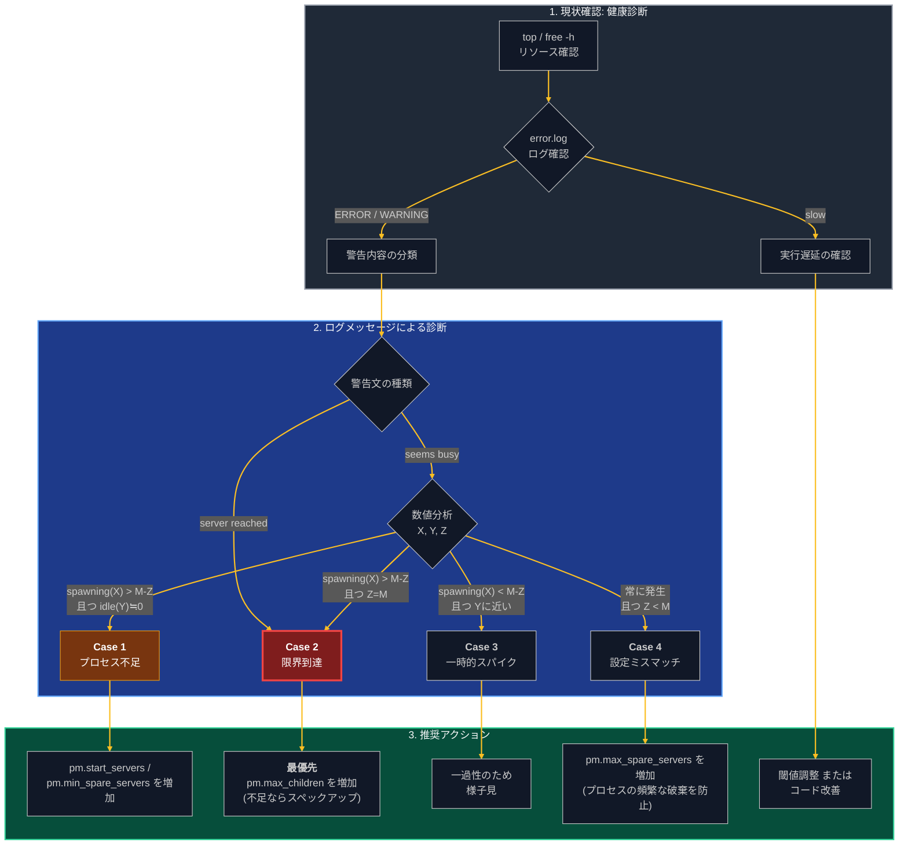

本記事は、大規模なインスタンスを運用しているエンジニア向けのPHP-FPMチューニングガイドです。
警告ログ（seems busy / server reached）の読み方だけでなく、「設定チューニング・スペックアップ・コード改善のどれを、どの順番で打つか」まで扱います。

:::note alert
本記事の情報を利用したことにより生じた損害や問題について、筆者は一切の責任を負いません。設定変更は十分な検証の上で行ってください。
:::

## 現状確認（システムの健康診断）

`top`
→ゾンビプロセスがいないか、CPUを長く(10時間とか)占有しているphp-fpmプロセスがないか

`free -h`
→待機プロセス(max_children)を増やした場合など、メモリに余裕があるか(スワップは遅い)

`sudo cat /var/log/php-fpm/error.log | grep ERROR`
→エラーが出ていないか

`sudo cat /var/log/php-fpm/error.log | grep WARNING`
→警告全般が出ていないか

`executing too slow`（スローログ）
→デフォルトでは出力されません。1時間に数十回程度、かつ発生時間にバラつきがある場合は、閾値を調整して様子を見るのが一般的です。

```php
[16-Feb-2026 03:20:56] WARNING: [pool www] child 14420, 
script '/var/www/app/current/public/index.php' (request: "GET /index.php") 
executing too slow (5.188485 sec), logging
```

`sudo cat /var/log/php-fpm/error.log | grep seems`
→totalとmax_childrenを比較して、プロセス不足を推測します。ピークが緩やかなアプリケーションなら、80%超えたらとかで検知する、急激な場合は50%とかで見ておくなど。
server reach~が出ていなければ直ちには問題なし。

なお、この80%/50%という数字自体に絶対的な根拠はありません。本質は「警告が出てからserver reached（限界到達）までに、対処する時間的猶予がどれだけ残っているか」です。緩やかなピークなら80%で気づいてからでも間に合いますが、スパイク型のトラフィックだと80%から限界まで一瞬なので、早めの50%で拾っておく、という理屈です。なので、この閾値は自チームのトラフィック特性に合わせて疑ってよい数字です。決め打ちにせず、「seems busyが出てからserver reachedに至るまでの間隔」を一度ログで確認して、自分たちの猶予時間から逆算して決めるのをおすすめします。

`sudo cat /var/log/php-fpm/error.log | grep reach`
→処理が中断されている可能性あり。メモリの余裕を見てプロセスを増やすか、スペックアップ or slowが出ているものを解決していく。
この3つは「どれかを選ぶ」並列の選択肢ではなく、打つ順番があります（後述の「[対処の選択肢と打つ順番](#対処の選択肢と打つ順番)」参照）。

## 大まかな流れ
下記を使って、大まかな流れをmermaidにしました。
かなり複雑なフローチャートも再現高く描画できるためおすすめです。

https://nanyo-city.jpn.org/prompt/540.html



## カスタマイズ開始

seems busyとserver reachedの警告が出た場合の対処法を整理します

```php
WARNING: [pool www] seems busy (you may need to increase pm.start_servers, 
or pm.min/max_spare_servers), spawning X children, 
there are Y idle, and Z total children
WARNING: [pool www] server reached pm.max_children setting (N), consider raising it
```

seems busyについて

1. spawning children: 不足分を補うために新しく生成されたプロセス数
1. idle children: 現在、リクエストを待機している（暇な）プロセス数
1. total children: 現在生存している全プロセス数（稼働中 + 待機中）


pm.max_children（最大同時プロセス数）を M とした時
| 状況案    | X (生成数) | Y (待機数) | Z (合計数) | 診断結果         | 推奨アクション                                        |
|------------|---------|---------|---------|--------------|---------------------------------------------|
| Case 1 | M-Zより多い      | 0に近い    | Z < M   | プロセス不足（加速中）  | pm.start_servers と pm.min_spare_servers を増やす  |
| Case 2 | M-Zより多い      | 0に近い    | Z = M   | 限界到達（ボトルネック） | 最優先： pm.max_children を増やす、メモリ不足ならサーバー増強       |
| Case 3 | M-Zより少ない     | Zに近い    | Z < M   | 一時的なスパイク     | 一過性の可能性あり、頻発しなければ様子見                          |
| Case 4 | 常に発生    | 変動      | Z < M   | 設定のミスマッチ     | pm.max_spare_servers が少なすぎて、頻繁にプロセスを殺しては作っている |


### 具体例1：限界に近いケース

```php
seems busy (...), spawning 8 children, there are 0 idle, and 43 total children
```
条件設定: pm.max_children (M) = 50 と仮定
X = 8なので、Mは50なのでM-Zより多い
Y = 0 （余裕なし）
Z = 43 Mは50なので、Z < Mですがほぼイコール
→Case 2に該当、pm.max_childrenの引き上げを検討してください。


### 具体例2：一時的な負荷のケース
```php
seems busy (...),spawning 8 children, there are 18 idle, and 82 total children
```
条件設定: pm.max_children (M) = 100 と仮定
X = 8なので、Mは100なのでM-Zより少ない
Y = 18
Z = 82 Mは100なので、Z < M
→Case 3に該当。一時的な変動であり、即座の対応は不要です。


## 対処の選択肢と打つ順番

診断ができたら対処ですが、突き詰めると選択肢は3つしかありません。ただし「どれを選ぶか」ではなく「どの順番で打つか」の問題です。

| 選択肢 | コスト | 効果が出るまで | リスク・限界 |
|--------|--------|----------------|--------------|
| ① 設定チューニング（pm系の調整） | ほぼゼロ | 即日 | サーバーのメモリが天井。盛りすぎるとスワップして逆に遅くなる |
| ② スペックアップ | 金で解決 | 速い（稟議が通れば） | 恒久的にコストが増える。根本原因は残ったまま |
| ③ コード改善（slowの解消） | 工数大 | 遅い（見積もり次第） | 根本解決だが、効果は直してみるまで不確実 |

判断軸は3つです。

- **緊急度**：server reachedが頻発しているなら、まず①を即日で打つ。①の天井（`free -h` で見たメモリ余剰）が尽きているなら②へ
- **予算**：②は一度上げたら下げにくい恒久コスト。月額の増分と③の工数を天秤にかける
- **slowログの有無**：slowが出ていれば③の改善対象が特定できている状態。出ていなければ③は当てずっぽうになるので、まずslowlogの閾値設定から始める

基本の型は「**まず①で時間を買い、その間に③を計画する**」です。①はコストゼロで即日打てるので、これで凌げている間にslowログを集めて③の見積もりを立てる。①の天井（メモリ）に当たったら②で天井ごと上げる。逆に①を飛ばしていきなり②や③に行くと、無料で済んだはずの対処に金か工数を払うことになります。

### スペックアップの稟議を通すなら

②は自分一人では決められないことが多いので、説明材料を先に揃えておきます。実は本記事の「現状確認」で集めたものがそのまま使えます。

- seems busy / server reached の発生頻度と推移 →「詰まっている事実」
- ピーク時のメモリ余剰（`free -h`）→「設定チューニング（①）はもう天井」という根拠
- slowログの状況 →「コード改善（③）で解決できる見込みと、それまでの凌ぎ方」

「なんとなく重いので増強したい」ではなく「ログ上ここで詰まっていて、無料でできる対処は天井に達した」と言えるかどうかで、話の通り方が変わります。

## 最後に
下記が非常に優秀で、どうしてもAIをふらっと使う感じが多かったですが、ダラダラせず目的に沿った必要な情報をサクッと受け取れるようになりました。

http://www.city.nanyo.yamagata.jp/dxchosei/5793

ただ、いちいちコピペが面倒なので、一旦gemsに入れて運用しています。
この診断フロー、頭の中に置いたままだと「警告ログを読める人」だけの属人ノウハウで終わってしまうんですよね。gemに固定しておけば、ログを貼るだけで誰でも同じ手順の一次診断ができるので、自分がいなくてもチームが動けます。診断の仕組み化はここまでやって初めて意味があると思っています。
今後はGUI化したいのと、プロンプトのバージョン管理ができればなあと思います。
ただ、そもそもプロンプトをいちいち精査するのも面倒で、汎用的なものも使いたくなりますが、やはり方向性がブレるので、モデルの検討し直しをしたいです。

ご意見お待ちしてます！
